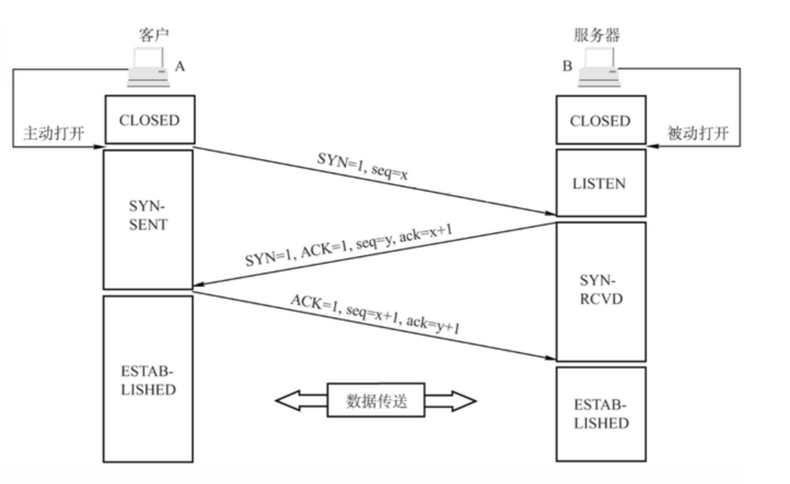

### **各层网络协议**

| TCP/IP四层参考模型 | 对应协议             |
| ------------------ | -------------------- |
| 应用层             | HTTP、FTP、SMTP、DNS |
| 传输层             | TCP、UDP             |
| 网络层             | IP、ICMP、ARP、RARP  |
| 数据链路层         | FDDI、Ethernet、PPP  |

### IP地址分类

- 全零(“0.0.0.0”)地址对应于当前主机。全“1”的IP地址(“255.255.255.255”)是当前子网的广播地址。

- 在IP地址3种主要类型里，各保留了3个区域作为私有地址，也就是比较常用的ip地址。其地址范围如下：
  - A类地址：0.0.0.0～126.255.255.255
  - A类私有地址：10.0.0.0～10.255.255.255
  - 环路测试地址：127.0.0.0～127.255.255.255
  - B类地址：128.0.0.0～191.255.255.255
  - B类私有地址：172.16.0.0～172.31.255.255
  - C类地址：192.0.0.0.～223.255.255.255
  - C类私有地址：192.168.0.0～192.168.255.255

### HTTP状态码

| 状态码 | 内容                                           |
| ------ | ---------------------------------------------- |
| 1**    | 信息，服务器收到请求，需要请求者继续执行操作   |
| 2**    | 成功，操作被成功接收并处理                     |
| 3**    | 重定向，需要进一步的操作以完成请求             |
| 4**    | 客户端错误，请求包含语法错误或无法完成请求     |
| 5**    | 服务器错误，服务器在处理请求的过程中发生了错误 |
|        |                                                |

- 200 - 请求成功
- 301 - 资源（网页等）被永久转移到其它URL
- 404 - 请求的资源（网页等）不存在
- 500 - 内部服务器错误

### **http2**

http2.0是一种安全高效的下一代http传输协议。安全是因为http2.0建立在https协议的基础上，高效是因为它是通过二进制分帧来进行数据传输。正因为这些特性，http2.0协议也在被越来越多的网站支持。据统计，截止至2018年8月，已经有27.9%的网站支持http2.0。

**●对1.x协议语意的完全兼容**

2.0协议是在1.x基础上的升级而不是重写，1.x协议的方法，状态及api在2.0协议里是一样的。

**●性能的大幅提升**

2.0协议重点是对终端用户的感知延迟、网络及服务器资源的使用等性能的优化。

## TCP链接

